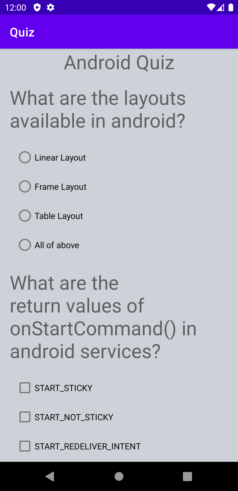
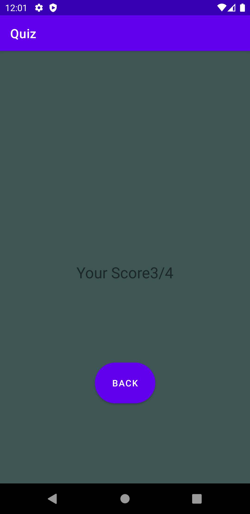

# Quiz
Android quiz application that tests on Android Studio.There are a total of four questions,one takes in a text input from the user.Once the user clicks on the submit button, user's answer become final and cannot be altered.

# Objective
The goal is to create an educational app that quizzes a user about a certain topic of your choice.

          
